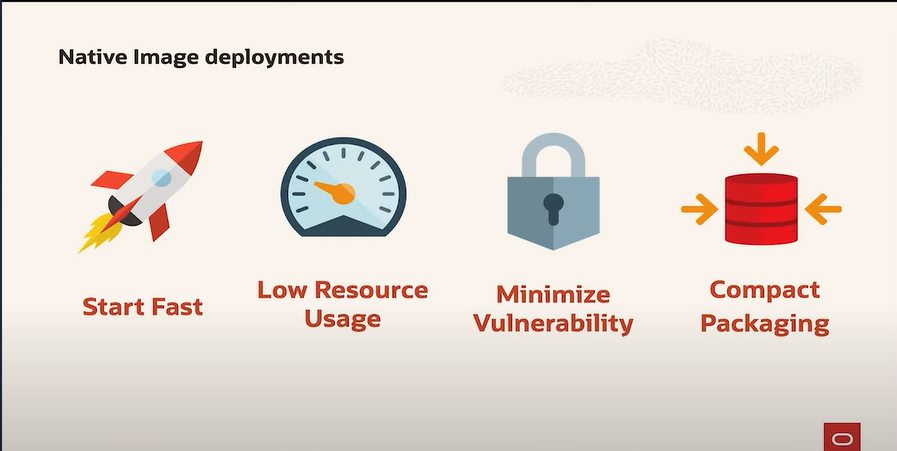
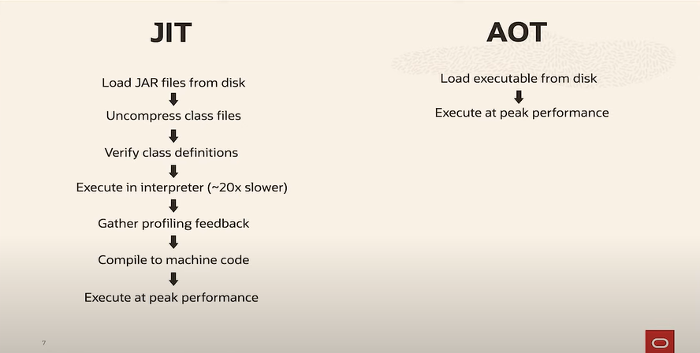
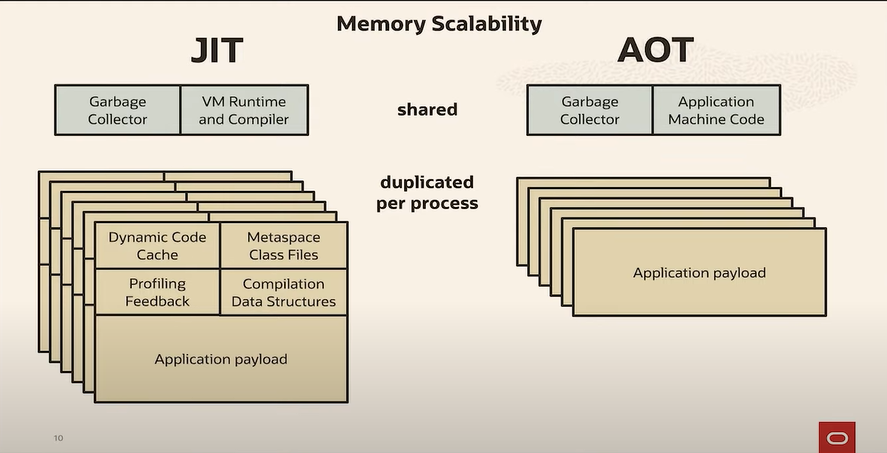

Execution process when compared to JAR vs Native 




Memory when scaling




## Getting Started


```bash
./gradlew bootBuildImage
```

```bash
docker run --rm -p 8080:8080 spring-native:0.0.1-SNAPSHOT
```
